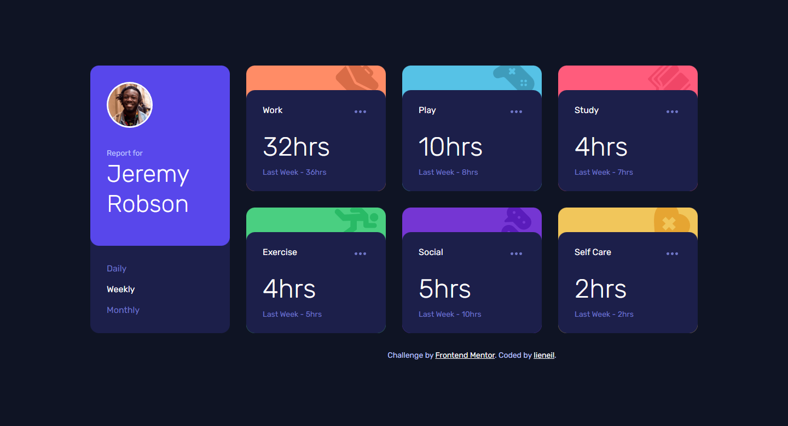
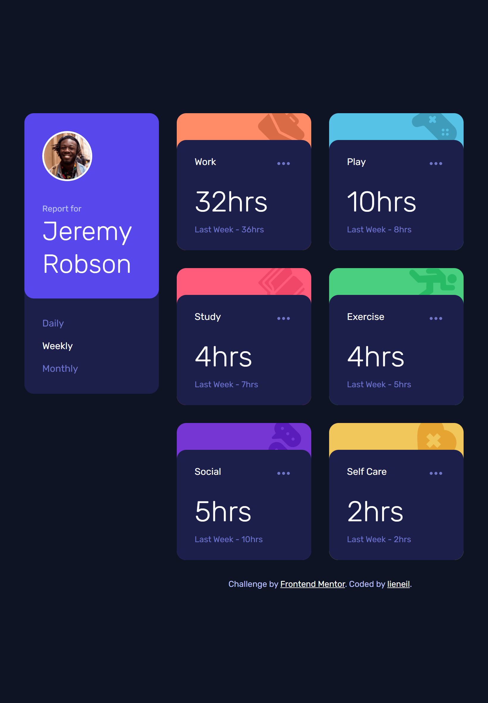
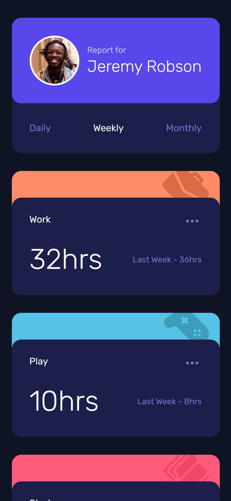

# Frontend Mentor - Time tracking dashboard solution

This is a solution to the [Time tracking dashboard challenge on Frontend Mentor](https://www.frontendmentor.io/challenges/time-tracking-dashboard-UIQ7167Jw). Frontend Mentor challenges help you improve your coding skills by building realistic projects. 

## Table of contents

- [Overview](#overview)
  - [The challenge](#the-challenge)
  - [Screenshot](#screenshot)
  - [Links](#links)
- [My process](#my-process)
  - [Built with](#built-with)
  - [What I learned](#what-i-learned)
  - [Useful resources](#useful-resources)

## Overview

### The challenge

Users should be able to:

- View the optimal layout for the site depending on their device's screen size
- See hover states for all interactive elements on the page
- Switch between viewing Daily, Weekly, and Monthly stats

### Screenshot

 
 

### Links

- [Live Demo](https://njvs.github.io/time-tracking-dashboard/)

## My process

### Built with

- HTML and CSS
- Vanilla Javascript
- [SASS/SCSS](https://sass-lang.com) - CSS with superpower
- CSS custom properties
- Flexbox
- CSS Grid
- Responsive Web Design

### What I learned

Instead of changing the text of every timecard, what I have done is just create a new card element and append it inside the container. By doing this, I can simply add a new activity, such as `Sleep`, to the `data.json` file, and it will automatically add a new card inside the html; while I still need to add a new card theme for background color and for the icon, I believe this is easier than modifying the html file everytime Ill add new activity. 

I acctually struggle more with CSS than with Javascript but overall this is a fun project and I enjoy it.

### Useful resources

- [A Complete Guide to Grid](https://css-tricks.com/snippets/css/complete-guide-grid/) - I alway open this guide everytime I use CSS Grid
- [A Complete Guide to Flexbox](https://css-tricks.com/snippets/css/a-guide-to-flexbox/) - This is for CSS Flexbox
- [An opinionated styleguide for writing sane, maintainable and scalable Sass.](https://sass-guidelin.es/)